> 🌐 本文档由 [microsoft/playwright](https://github.com/microsoft/playwright) 翻译,英文原版见原项目。
>
> 📝 注:本文超过 10000 字符,按约定仅翻译核心章节;命令与截图路径保持原样。

import LiteYouTube from '@site/src/components/LiteYouTube';

## 简介

Playwright VS Code 扩展把 Playwright Test 的能力直接带进编辑器,让你以流畅的 UI 驱动体验运行、调试和生成测试。本指南将带你完成扩展的安装,并使用其核心功能为你的端到端测试工作流提速。

<LiteYouTube
    id="WvsLGZnHmzw"
    title="Getting Started with Playwright in VS Code"
/>

## 前置条件

开始之前,请确保已安装:

- [Node.js](https://nodejs.org/)(建议 LTS 版本)
- [Visual Studio Code](https://code.visualstudio.com/)

## 起步

### 安装与设置

1.  **安装扩展**:在 VS Code 中打开扩展视图(`Ctrl+Shift+X` 或 `Cmd+Shift+X`),搜索 "Playwright"。 [安装 Microsoft 官方扩展](https://marketplace.visualstudio.com/items?itemName=ms-playwright.playwright)。

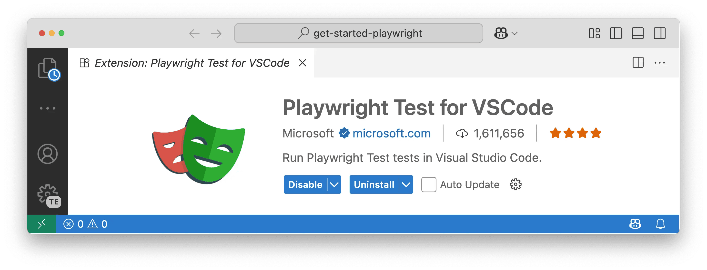

1.  **安装 Playwright**:扩展安装完成后,打开命令面板(`Ctrl+Shift+P` 或 `Cmd+Shift+P`)并运行 **Test: Install Playwright** 命令。

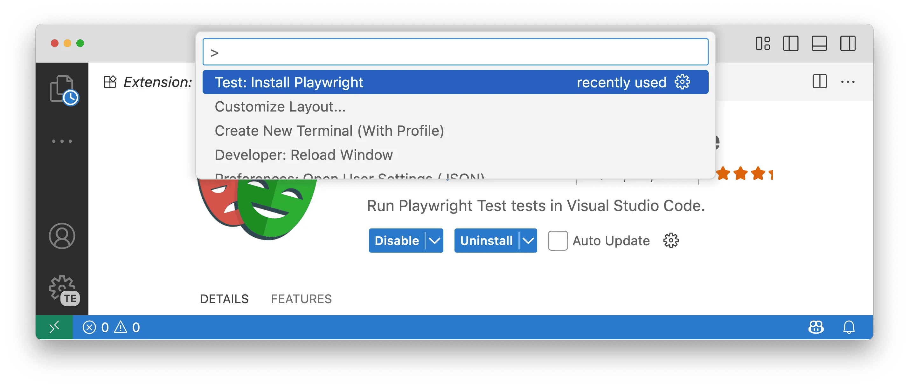

3.  **选择浏览器**:为测试选择所需浏览器(如 Chromium、Firefox、WebKit)。也可以添加一个 GitHub Actions workflow 在 CI 中运行测试。这些设置之后可以在 `playwright.config.ts` 文件中修改。

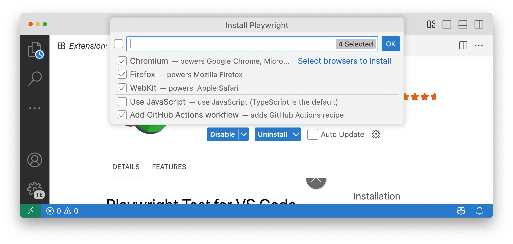

### 打开测试侧边栏

点击 VS Code 活动栏中的 **Testing 图标** 打开测试资源管理器。在这里你可以看到你的测试,以及用于管理项目、工具和设置的 Playwright 侧边栏。

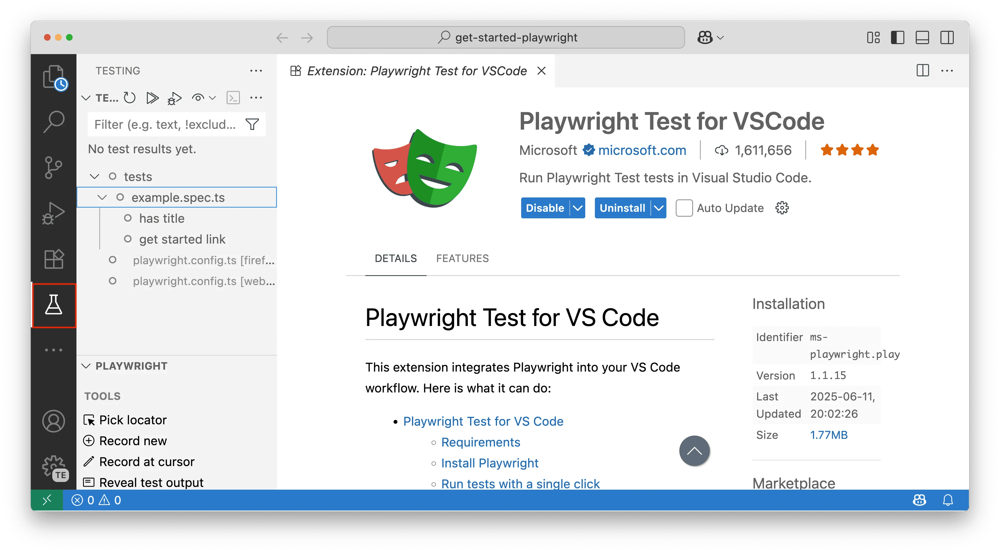

## 核心功能

### 运行测试

<LiteYouTube
    id="mQmcIBMsc38"
    title="Running Playwright Tests in VS Code"
/>

-   **运行单个测试**:点击任意测试旁的绿色 "play" 图标即可运行。测试通过时按钮变为绿色对勾,失败时变为红色叉号。测试名称旁会显示运行耗时。同时,VS Code 底部会自动打开 Test Results 面板,展示测试执行摘要:运行了多少测试、通过/失败/跳过多少,以及总耗时。

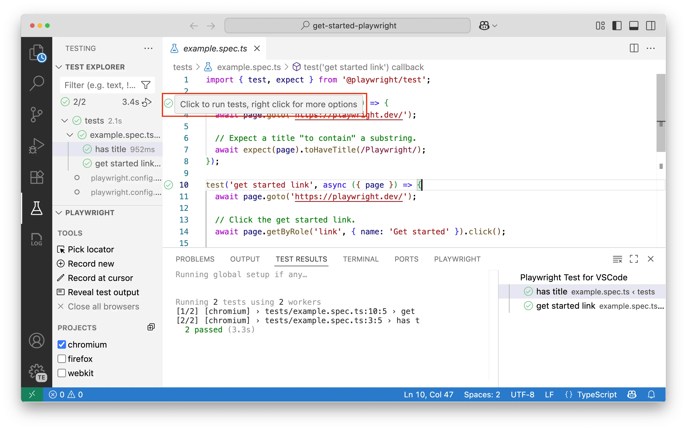

-   **运行所有测试**:可以在不同层级运行全部测试。点击某个测试文件旁的 play 图标运行该文件内的所有测试,或点击测试资源管理器最顶部的 play 图标运行整个项目的所有测试。

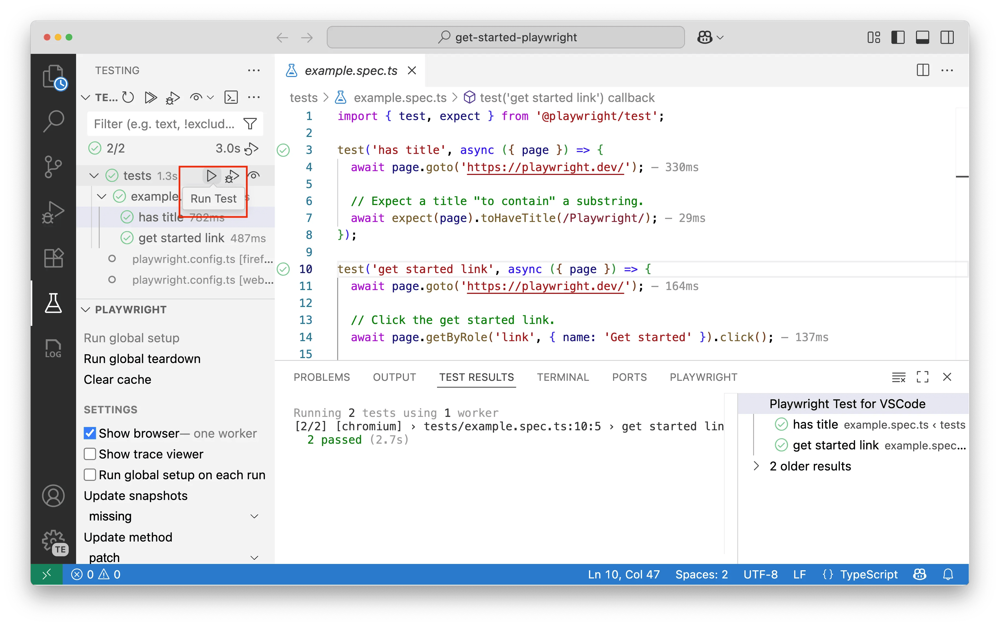

-   **在多个浏览器上运行**:在 Playwright 侧边栏勾选要测试的项目(浏览器)。Playwright 中的 project 代表不同的浏览器配置——每个项目通常对应一个特定浏览器(如 Chromium、Firefox 或 WebKit),并带有各自的视口大小、设备模拟或其他浏览器专属选项。运行测试时,它会在所有选中的项目上执行,从而验证应用在不同浏览器和配置下表现一致。

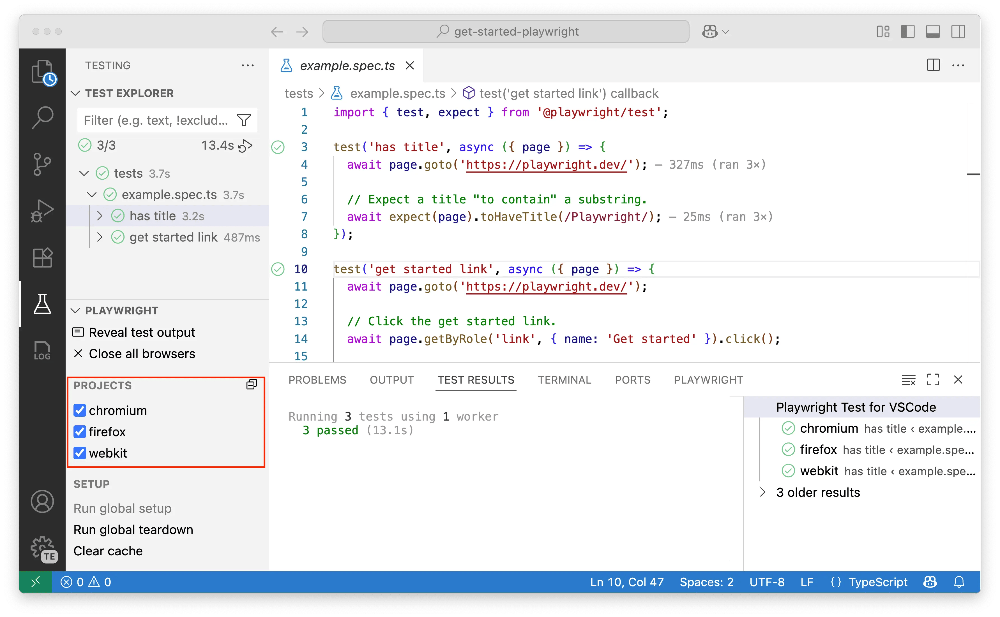

-   **显示浏览器**:想在实时浏览器窗口中观看测试执行,请启用侧边栏的 **Show Browser** 选项。禁用后则以无头模式运行(测试在后台执行,不打开可见的浏览器窗口)。

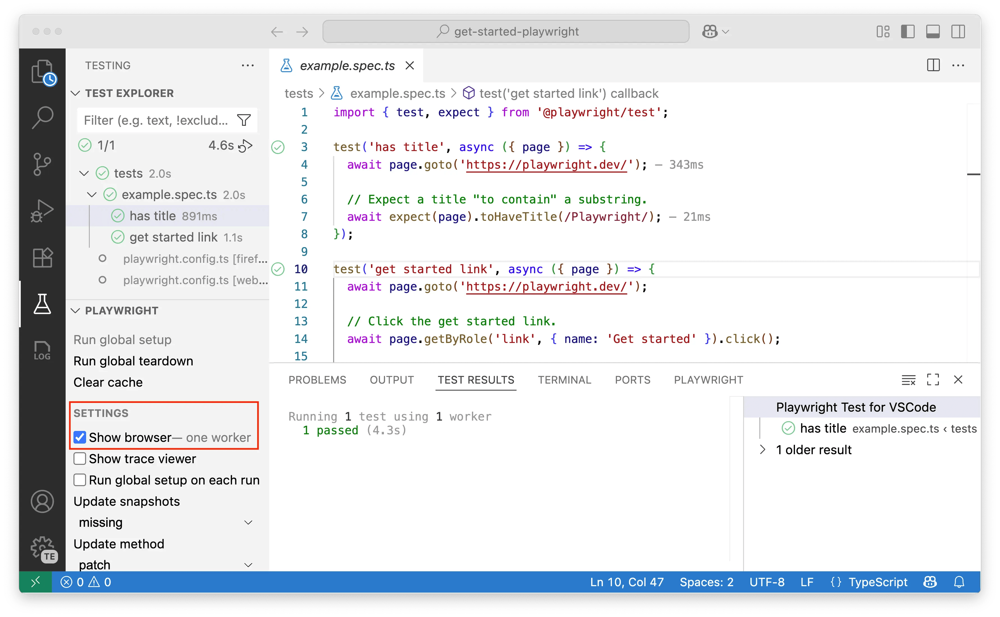

### 调试测试

<LiteYouTube
    id="tJF7UhA59Gc"
    title="Debugging Playwright tests in VS Code"
/>

VS Code 扩展提供了强大的调试工具,帮助你定位并修复测试中的问题。你可以设置断点、检查变量、查看详细错误信息、获得 AI 驱动的失败修复建议,并使用功能完备的 trace viewer 逐步分析测试执行过程。

-   **使用断点**:点击行号旁的装订线(gutter)设置断点。右键测试并选择 **Debug Test**。测试会在断点处暂停,方便你检查变量并单步执行代码。

    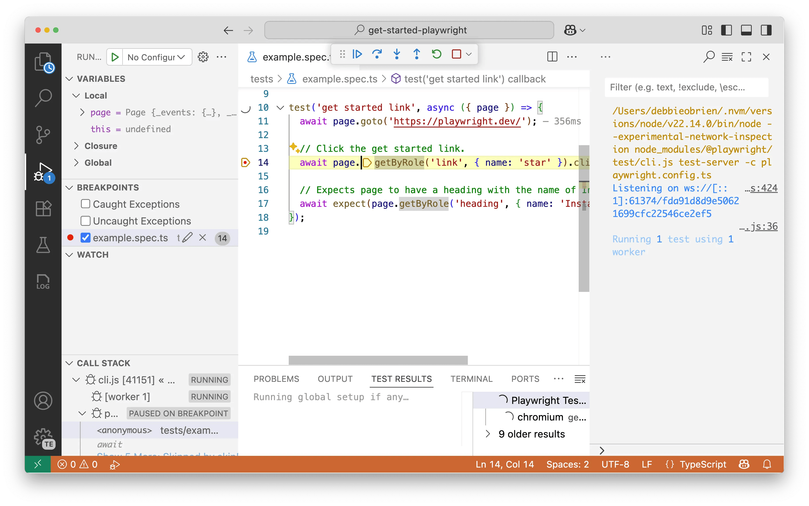

-   **实时调试**:启用 **Show Browsers** 后,点击代码中的定位器(locator),Playwright 会在浏览器中高亮对应元素,方便验证定位器。

 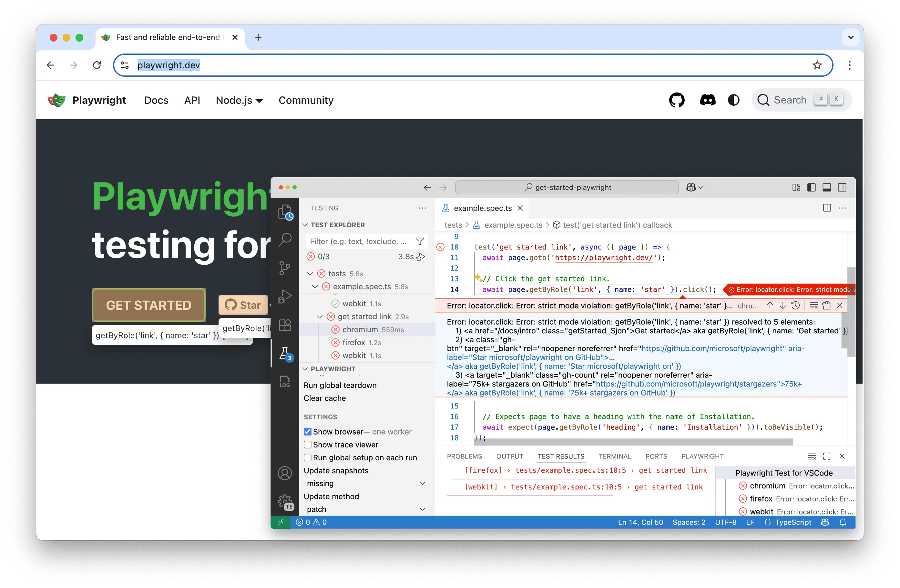

-   **查看错误信息**:测试失败时,扩展会直接在编辑器中显示详细错误,包括期望值与实际值的对比以及完整的调用日志。

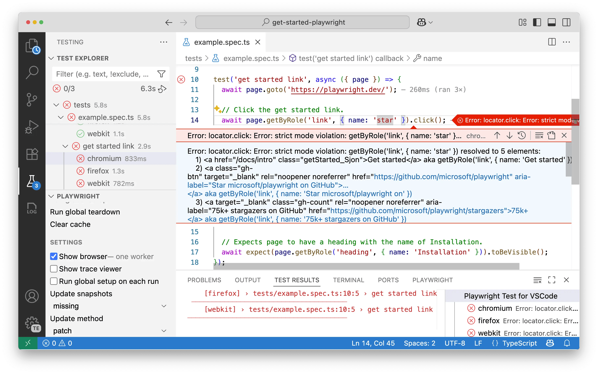

-   **AI 修复**:测试失败时,点击错误旁的闪光图标,可从 Copilot 获得 AI 修复建议。Copilot 会分析错误并给出解决问题的代码修改。

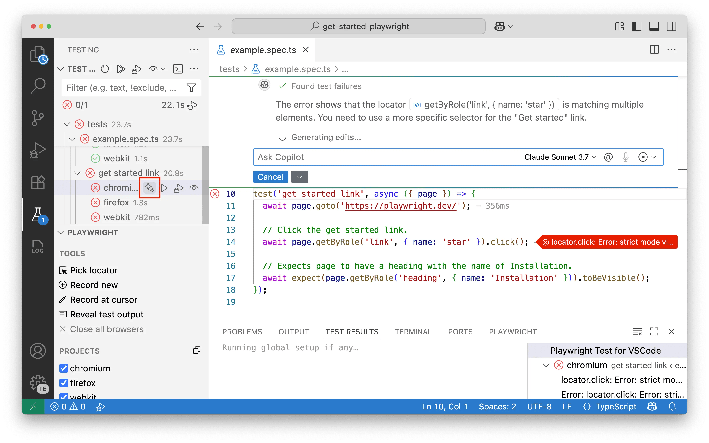

-   **使用 Trace Viewer 调试**:要进行全面调试,请在 Playwright 侧边栏启用 **Show Trace Viewer**。测试结束后会自动打开详细 trace,提供完整的测试执行时间线。trace viewer 特别适用于:
    - **逐步分析**:按精确时间戳浏览测试执行的每一个动作
    - **DOM 检查**:查看测试执行过程中任意时刻的 DOM 快照,看清页面的确切样子
    - **网络监控**:检查测试期间发生的所有网络请求和响应
    - **控制台日志**:访问浏览器产生的所有控制台消息和错误
    - **源码映射**:直接跳转到执行每个动作的源代码
    - **可视化调试**:查看截图,了解用户在每一步实际看到的内容

    trace viewer 在调试 flaky 测试或理解复杂用户交互时尤其有价值。

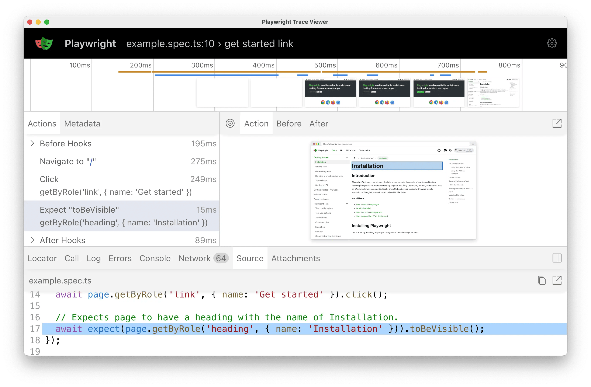

了解更多,请参阅 [Trace Viewer 指南](./trace-viewer.md)。

### 使用 CodeGen 生成测试

CodeGen 是 Playwright 强大的测试生成工具,通过录制你与网页的交互自动生成测试代码。你无需从零开始写测试,只需在应用中走一遍操作,CodeGen 就会捕获你的动作,并将其转换为带有规范定位器和断言的可靠测试代码。

<LiteYouTube
    id="5XIZPqKkdBA"
    title="Generating Playwright tests in VS Code"
/>

-   **录制新测试**:点击侧边栏的 **Record new**。会打开一个浏览器窗口,你操作页面时,Playwright 会自动生成测试代码。你也可以在录制工具栏上生成断言。

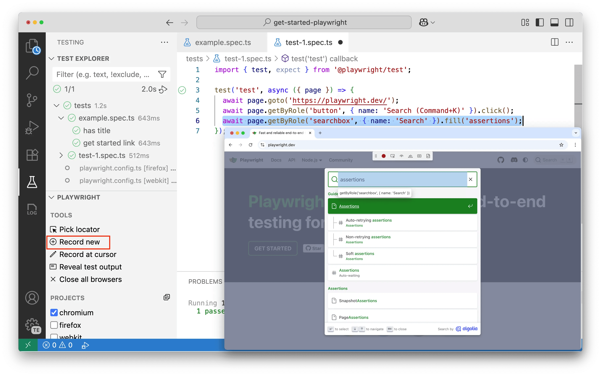

-   **从光标处录制**:把光标放在已有测试内部,点击 **Record at cursor**,在该位置追加新的操作。
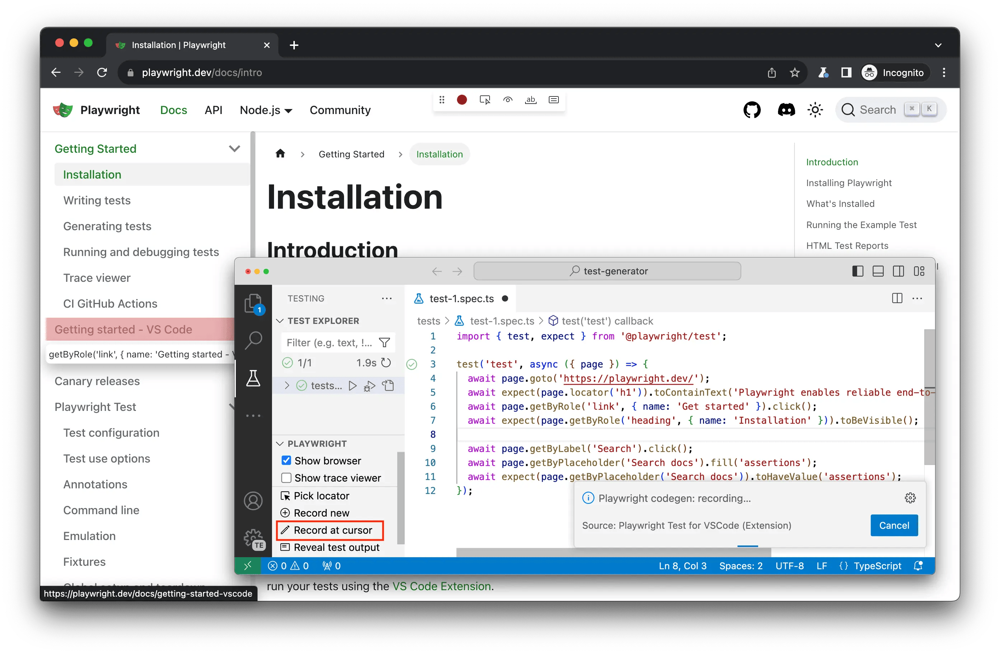

-   **拾取定位器**:使用 **Pick locator** 工具点击已打开浏览器中的任意元素,Playwright 会选出最佳定位器并复制到剪贴板,随时可粘贴到代码中。

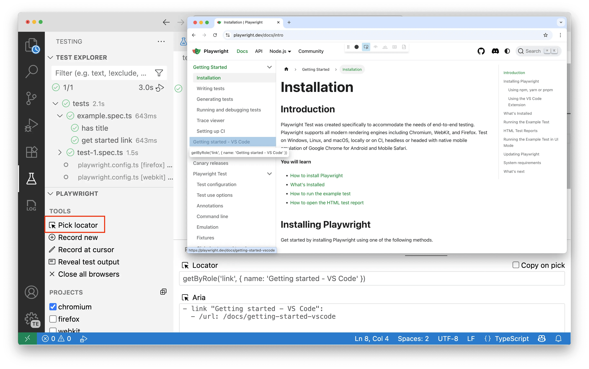

了解更多,请参阅 [CodeGen 指南](./codegen.md)。

## 高级功能

### 项目依赖

使用[项目依赖(project dependencies)](./test-projects.md)定义在其他测试之前运行的 setup 测试。例如,可以先创建一个登录测试,然后跨多个测试复用该登录态,而不必每个测试都重新登录。在 VS Code 中,你可以在测试资源管理器中看到这些 setup 测试,并按需独立运行。

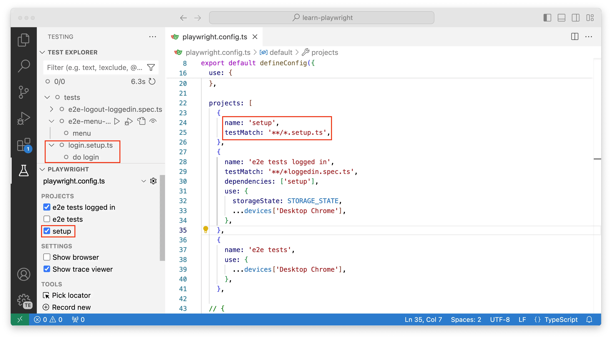

了解更多,请参阅 [Project Dependencies 指南](./test-projects.md)。

### 全局 Setup

对于只需在所有测试之前运行一次的任务(例如填充数据库种子数据),使用 **Global Setup**。你可以在 Playwright 侧边栏中手动触发全局 setup 与 teardown。

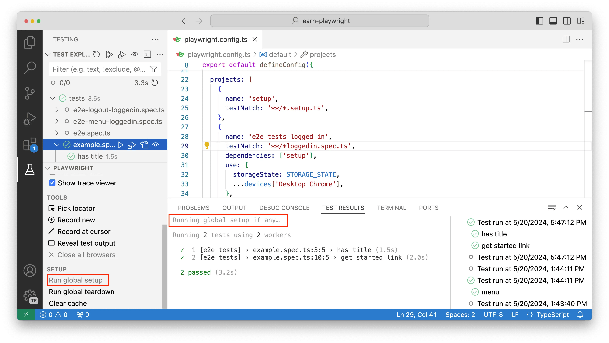

### 多配置切换

如果你有多个 `playwright.config.ts` 文件,可以通过 Playwright 侧边栏中的齿轮图标切换。这让你能轻松在不同测试套件或环境之间切换。

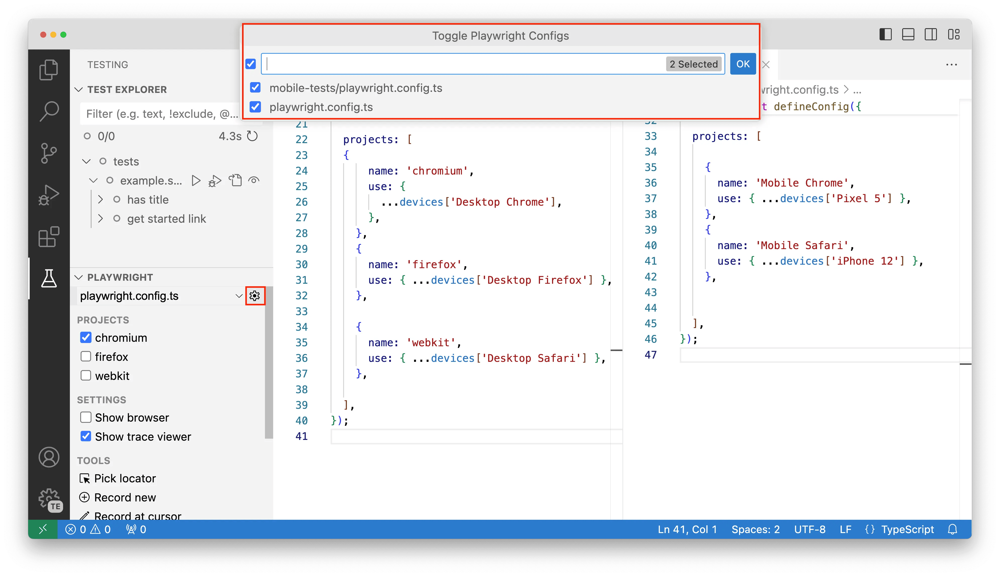

## 快速参考

| 操作                    | VS Code 中如何操作                                          |
| ----------------------- | ----------------------------------------------------------- |
| **安装 Playwright**     | 命令面板 → `Test: Install Playwright`                       |
| **运行测试**            | 点击测试旁的 "play" 图标                                    |
| **调试测试**            | 设置断点,右键测试 → `Debug Test`                           |
| **显示实时浏览器**      | 在 Playwright 侧边栏启用 `Show Browsers`                    |
| **录制新测试**          | 点击 Playwright 侧边栏的 `Record new`                       |
| **拾取定位器**          | 点击 Playwright 侧边栏的 `Pick locator`                     |
| **查看测试 Trace**      | 在 Playwright 侧边栏启用 `Show Trace Viewer`                |

## 下一步

-   [使用 web-first 断言、page fixture 和定位器编写测试](./writing-tests.md)
-   [在 CI 上运行测试](./ci-intro.md)
-   [进一步了解 Trace Viewer](./trace-viewer.md)
