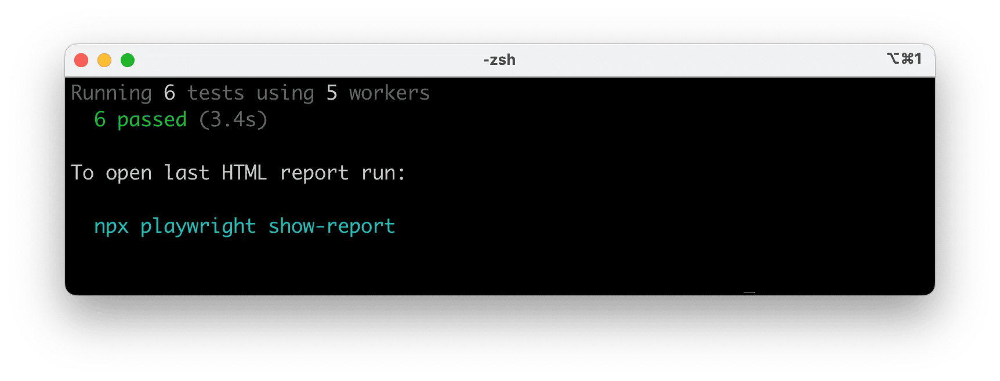
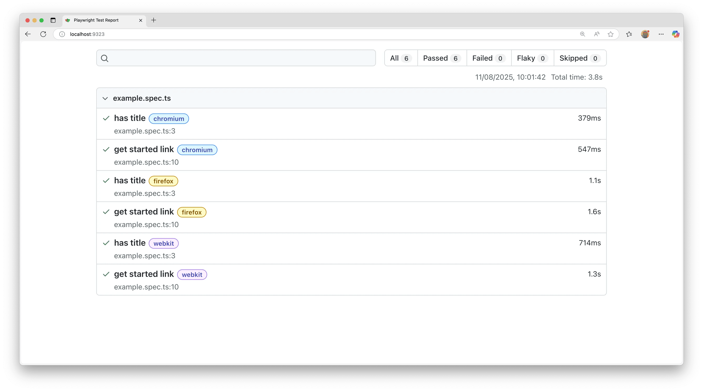
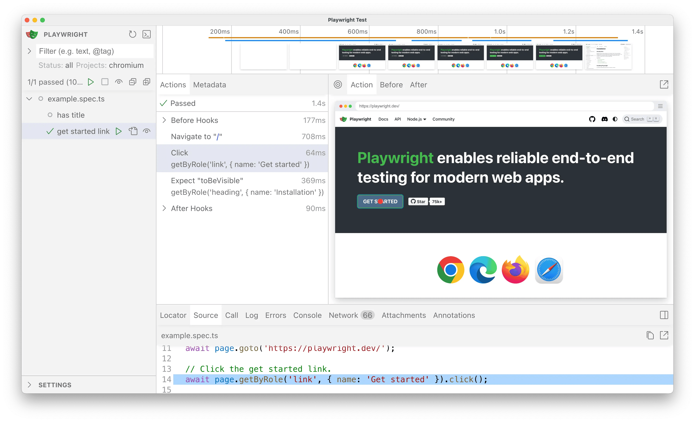

> 🌐 本文档由 [microsoft/playwright](https://github.com/microsoft/playwright) 翻译,英文原版见原项目。

## 简介

Playwright Test 是面向现代 Web 应用的端到端测试框架,内置测试运行器、断言、隔离机制、并行化以及丰富的配套工具。Playwright 支持 Windows、Linux 和 macOS 上的 Chromium、WebKit 与 Firefox,可在本地或 CI 中以无头或有头方式运行,并为 Chrome(Android)与 Mobile Safari 提供原生移动端模拟。

**你将学到**

- [如何安装 Playwright](/intro.md#installing-playwright)
- [安装了什么](/intro.md#whats-installed)
- [如何运行示例测试](/intro.md#running-the-example-test)
- [如何打开 HTML 测试报告](/intro.md#html-test-reports)

## 安装 Playwright

使用以下任一方式安装 Playwright 即可开始。

### 使用 npm、yarn 或 pnpm

下面的命令要么初始化一个新项目,要么把 Playwright 添加到现有项目。

<Tabs
  groupId="js-package-manager"
  defaultValue="npm"
  values={[
    {label: 'npm', value: 'npm'},
    {label: 'yarn', value: 'yarn'},
    {label: 'pnpm', value: 'pnpm'}
  ]
}>
<TabItem value="npm">

```bash
npm init playwright@latest
```

</TabItem>

<TabItem value="yarn">

```bash
yarn create playwright
```

</TabItem>

<TabItem value="pnpm">

```bash
pnpm create playwright
```

</TabItem>

</Tabs>

按提示选择/确认:
- TypeScript 还是 JavaScript(默认:TypeScript)
- 测试文件夹名称(默认:`tests`,若 `tests` 已存在则为 `e2e`)
- 是否添加 GitHub Actions workflow(CI 推荐)
- 是否安装 Playwright 浏览器(默认:是)

之后可以重新运行该命令;它不会覆盖已有测试。

### 使用 VS Code 扩展

你也可以使用 [VS Code 扩展](./getting-started-vscode.md)创建并运行测试。

## 安装了什么

Playwright 会下载所需的浏览器二进制文件,并创建如下脚手架。

```bash
playwright.config.ts         # Test configuration
package.json
package-lock.json            # Or yarn.lock / pnpm-lock.yaml
tests/
  example.spec.ts            # Minimal example test
```

[playwright.config](./test-configuration.md) 集中管理配置:目标浏览器、超时、重试、项目、报告器等。在现有项目中,依赖会加入你当前的 `package.json`。

`tests/` 目录包含一个最小化的入门测试。

## 运行示例测试

默认情况下,测试以无头模式在 Chromium、Firefox 和 WebKit 上并行运行(可在 [playwright.config](./test-configuration.md) 中配置)。输出与汇总结果显示在终端中。

<Tabs
  groupId="js-package-manager"
  defaultValue="npm"
  values={[
    {label: 'npm', value: 'npm'},
    {label: 'yarn', value: 'yarn'},
    {label: 'pnpm', value: 'pnpm'}
  ]
}>
<TabItem value="npm">

```bash
npx playwright test
```

</TabItem>

<TabItem value="yarn">

```bash
yarn playwright test
```

</TabItem>

<TabItem value="pnpm">

```bash
pnpm exec playwright test
```

</TabItem>

</Tabs>



提示:
- 想看到浏览器窗口:加 `--headed`。
- 只运行某个项目/浏览器:`--project=chromium`。
- 只运行一个文件:`npx playwright test tests/example.spec.ts`。
- 打开测试 UI:`--ui`。

过滤、有头模式、分片与重试的详情,参见[运行测试](./running-tests.md)。

## HTML 测试报告

测试运行结束后,[HTML 报告器](./test-reporters.md#html-reporter)提供一个可按浏览器、通过、失败、跳过、flaky 等条件筛选的仪表盘。点击某个测试可查看错误、附件和步骤。它只在出现失败时自动打开;也可以用下面的命令手动打开。

<Tabs
  groupId="js-package-manager"
  defaultValue="npm"
  values={[
    {label: 'npm', value: 'npm'},
    {label: 'yarn', value: 'yarn'},
    {label: 'pnpm', value: 'pnpm'}
  ]
}>
<TabItem value="npm">

```bash
npx playwright show-report
```

</TabItem>

<TabItem value="yarn">

```bash
yarn playwright show-report
```

</TabItem>

<TabItem value="pnpm">

```bash
pnpm exec playwright show-report
```

</TabItem>

</Tabs>



## 在 UI 模式下运行示例测试

使用 [UI 模式](./test-ui-mode.md)运行测试,可获得 watch 模式、实时步骤视图、时间旅行调试等能力。

<Tabs
  groupId="js-package-manager"
  defaultValue="npm"
  values={[
    {label: 'npm', value: 'npm'},
    {label: 'yarn', value: 'yarn'},
    {label: 'pnpm', value: 'pnpm'}
  ]
}>

<TabItem value="npm">

```bash
npx playwright test --ui
```

</TabItem>

<TabItem value="yarn">

```bash
yarn playwright test --ui
```

</TabItem>

<TabItem value="pnpm">

```bash
pnpm exec playwright test --ui
```

</TabItem>

</Tabs>



watch 过滤器、步骤详情与 trace 集成等,参见 [UI 模式详细指南](./test-ui-mode.md)。

## 更新 Playwright

更新 Playwright 并下载新的浏览器二进制文件及其依赖:

<Tabs
  groupId="js-package-manager"
  defaultValue="npm"
  values={[
    {label: 'npm', value: 'npm'},
    {label: 'yarn', value: 'yarn'},
    {label: 'pnpm', value: 'pnpm'}
  ]
}>

<TabItem value="npm">

```bash
npm install -D @playwright/test@latest
npx playwright install --with-deps
```

</TabItem>

<TabItem value="yarn">

```bash
yarn add --dev @playwright/test@latest
yarn playwright install --with-deps
```

</TabItem>

<TabItem value="pnpm">

```bash
pnpm install --save-dev @playwright/test@latest
pnpm exec playwright install --with-deps
```

</TabItem>

</Tabs>

查看已安装版本:

<Tabs
  groupId="js-package-manager"
  defaultValue="npm"
  values={[
    {label: 'npm', value: 'npm'},
    {label: 'yarn', value: 'yarn'},
    {label: 'pnpm', value: 'pnpm'}
  ]
}>

<TabItem value="npm">

```bash
npx playwright --version
```

</TabItem>

<TabItem value="yarn">

```bash
yarn playwright --version
```

</TabItem>

<TabItem value="pnpm">

```bash
pnpm exec playwright --version
```

</TabItem>

</Tabs>

## 系统要求

- Node.js:最新的 22.x、24.x 或 26.x。
- Windows 11+、Windows Server 2019+ 或适用于 Linux 的 Windows 子系统(WSL)。
- macOS 14(Sonoma)或更高版本。
- Debian 12 / 13,Ubuntu 22.04 / 24.04 / 26.04(x86-64 或 arm64)。

## 下一步

- [使用 web-first 断言、fixture 和定位器编写测试](./writing-tests.md)
- [运行单个或多个测试;有头模式](./running-tests.md)
- [使用 Codegen 生成测试](./codegen-intro.md)
- [查看测试 trace](./trace-viewer-intro.md)
